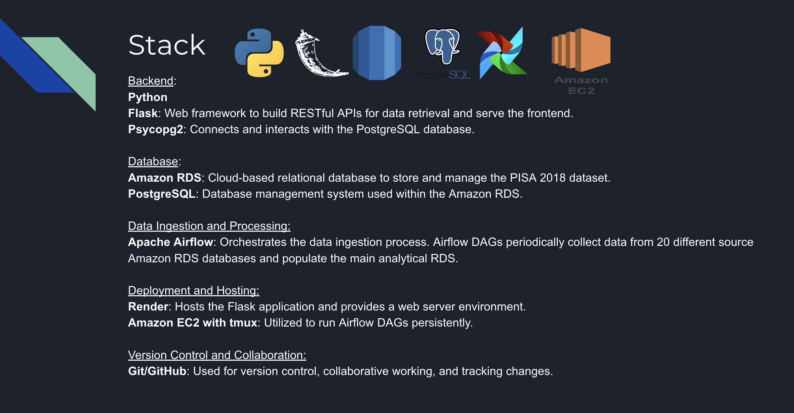

# PISA Project

The final project of the Makers Data Engineering specialist track.

## Project Overview

The goal of the project was to analyse the PISA 2018 dataset and develop a functioning dashboard that the client (GEI) can use to easily visualise and interpret the data. 

The project is carried out in a distributed environment in the Cloud to allow for efficient data processing and collaboration.

It was a team project, which I completed with two other colleagues. We used GitHub throughout the project for version control.

### About Global Education Insights (GEI)

Global Education Insights (GEI) is a non-profit organisation dedicated to improving education systems worldwide. They work with governments, educational institutions, and stakeholders to provide data-driven insights and recommendations for educational policy and practice.

### About PISA

PISA is the OECD's "Programme for International Student Assessment", which assesses educational practices around the world and uses its findings to influence policy.

### The Dataset

The dataset used in this project is a real-life dataset, collected in 2018 by PISA. It contains responses from hundreds of thousands of students, teachers and educational facilitators from 79 countries, providing information about their backgrounds and experiences in education.

For more information about the 2018 dataset, please follow this [link](https://www.oecd.org/pisa/data/2018database/).

For the purposes of this project, we took a sample of **20 countries**. Responses were submitted gradually over time, to simulate the real-life scenario of collecting data.

The dataset began at around 100 responses, but grew to over 100,000 in little over a week's time.

Extract from the raw data:

Structure
- 20 source databases, each holding data from a different country
- 1,120 columns in each database
- Varying amounts of rows in each database, but all constantly growing over time
- Column names coded, PISA index required to decode data

### Project Objectives

The main goal was to turn this unreadable, coded mass of data into something salient and insightful.

The project had three levels of challenge:

- **Level 1:** develop dashboard charts displaying correct summary data that is no more than an hour old.
- **Level 2:** the data should be no more than a minute old.
- **Level 3:** the data should be up-to-the-second.

## Solution Overview

For our solution we implemented the following:

- Airflow to routinely extract data from 20 source databases and load into an analytical database held on AWS RDS
- Flask app to transform and serve data to our dashboard app
- Dashboard app tp poll endpoint each second to constantly update data visualisations as responses are submitted
- All running in the Cloud, using AWS EC2 and Render (PaaS provider)

Data Pipeline - Planning Stage

Data Pipeline - Implemented

### Stack

The tech stack used in this project.

### Apache Airflow

Workflow orchestration tool used to pull data from 20 source databases and load them into an analytical database held on AWS RDS.

Tasks and order of flow defined in a Directed Acyclic Graph (DAG):

[PISA DAG](/airflow/pisa_dag.py)

DAG scheduled to run every 30 seconds to continuously and automatically keep pulling any new submissions, pooling them into a central database on which our dashboard was based.

DAG hosted inside an AWS EC2 instance to keep it running continously, independent from local machines.

Benefits of approach:
- **Resusable** - code accepts list of countries; more can easily be added to increase scope of project.
- **Scalable** - designed to only extract new entries to reduce latency. Runtime remained consistent, despite growing dataset.
- **Data Integrity** - checks made for duplicates and conflicts updated with new values, to ensure integrity and freshness of data.

Limitations:
- Minimum runtime of the DAG was 15 seconds, meaning the analytical database would be slightly out of date / not precisely real-time.
- Could be improved by reconfiguring concurrency / parallel computing settings, or by redesigining project to use a data streaming service, such as Kafka.

### Flask App

We designed the Flask app to extract data from the analytical database and then perform transformations on it, converting it to a usable format for the metrics dashboard.

The app was then hosted on Render, a Cloud platform service. Our web service supported Continuous Integration/Continous Deployment (CI/CD) practices, and would immediately redeploy each time the app was updated on GitHub.

Each time a GET request was made to the web service, the app would query the analytical database, providing the most up-to-date data and allowing our dashboard to give real-time insights.

The full code for this app (with comments) can be accessed here, in the 'render' directory of this repository:

[Flask App](/render/app.py)

### Dashboard

#### Forage

The dashboard was supplied to us by Makers. It was a custom React app, named "Forage", designed to accept data in `json` format.

We reverse engineered the dashboard app to ascertain the format our data needed to be in for the app to function correctly.

The dashboard was configured to poll a url every second, so that the visualisations would constantly update with new data, providing real-time insights.

**Overview of the completed dashboard:**

For more information on the metrics used and on how they were extracted, see the below notebook:

[Dashboard Metrics](/notebooks/dashboard_metrics.ipynb)

### Demo Day

As a final part of the project, we presented and demonstrated our application to stakeholders, internal and external to Makers Academy, including some with a non-technical background.

## Conclusion

In one week, the team and I developed an ETL pipeline which batch processed raw data from 20 different sources, transformed it into valuable insights and presented it in an attractive and intuitive metrics dashboard.

The entire application was hosted in the Cloud and automated, allowing resources to be fully accessible and for our dashboard to be continuously refreshed with the most current data.

Our application provided near real-time insights which could be used to guide policy and influence decision-makers across the world.

This project is licensed under MIT.
